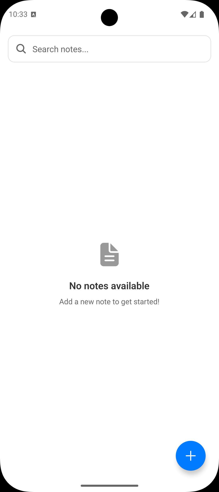
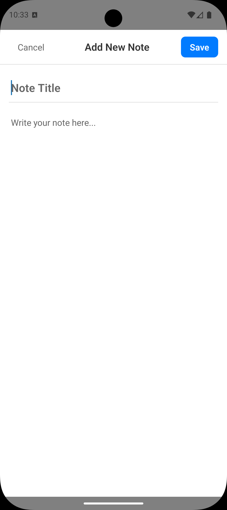
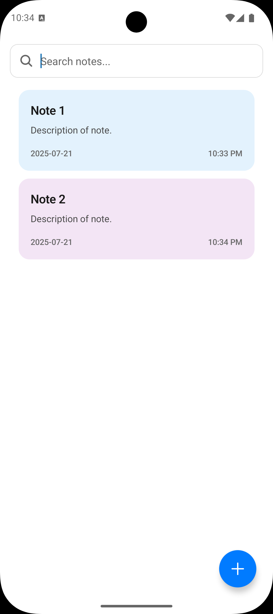
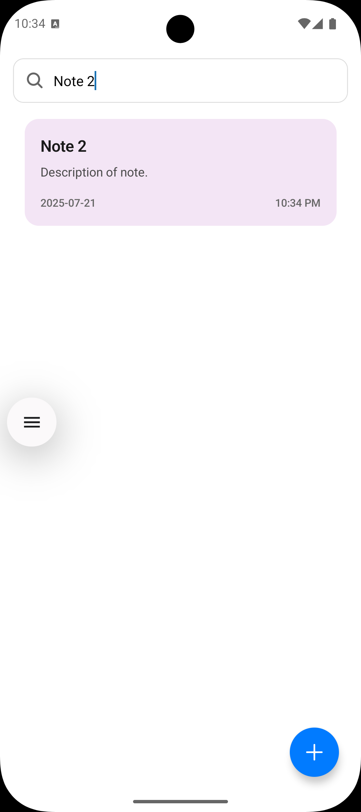

# � Notes App

A modern, feature-rich React Native notes application built with Expo Router and Firebase integration. Create, edit, search, and manage your notes with a beautiful dark/light theme interface.

## ✨ Features

- 📝 **Create & Edit Notes** - Add new notes with title and content
- 🔍 **Real-time Search** - Search through your notes instantly
- 🌓 **Dark/Light Mode** - Toggle between themes or use system preference
- 💾 **Offline Storage** - Works offline with AsyncStorage
- ☁️ **Cloud Sync** - Automatic Firebase Firestore synchronization
- 🎨 **Modern UI** - Clean, intuitive interface with smooth animations
- 📱 **Cross-platform** - Works on iOS, Android, and Web
- 🗑️ **Delete Protection** - Confirmation dialog before deleting notes
- 🔄 **Duplicate Prevention** - Prevents creating identical notes

## 🚀 Tech Stack

- **Framework**: React Native with Expo Router
- **Database**: Firebase Firestore
- **Storage**: AsyncStorage for offline functionality
- **UI Components**: Custom components with React Native
- **Icons**: Expo Vector Icons
- **State Management**: React Hooks (useState, useContext)
- **Navigation**: Expo Router
- **Styling**: StyleSheet API

## 📱 Screenshots

### � Latest Version (v1.0.2)

<div align="center">
  
  
  
  
</div>

## 🛠️ Installation & Setup

### Prerequisites

- Node.js (v16 or higher)
- npm or yarn
- Expo CLI
- Android Studio (for Android development)
- Xcode (for iOS development - macOS only)

### 1. Clone the repository

```bash
git clone https://github.com/YashBhalodiya/notes-app.git
cd notes-app
```

### 2. Install dependencies

```bash
npm install
# or
yarn install
```

### 3. Firebase Configuration

1. Create a new Firebase project at [Firebase Console](https://console.firebase.google.com/)
2. Enable Firestore Database
3. Copy your Firebase config and update `firebase.js`:

```javascript
const firebaseConfig = {
  apiKey: "your-api-key",
  authDomain: "your-project.firebaseapp.com",
  projectId: "your-project-id",
  storageBucket: "your-project.appspot.com",
  messagingSenderId: "your-sender-id",
  appId: "your-app-id"
};
```

### 4. Run the application

```bash
# Start development server
npm start

# Run on Android
npm run android

# Run on iOS
npm run ios

# Run on Web
npm run web
```

## 📁 Project Structure

```
notes-app/
├── app/
│   ├── _layout.tsx          # Root layout with theme provider
│   └── index.tsx            # Main screen entry point
├── src/
│   ├── components/
│   │   └── ui/              # Reusable UI components
│   │       ├── EmptyState.jsx
│   │       ├── FloatingActionButton.jsx
│   │       ├── LoadingSpinner.jsx
│   │       ├── SearchBar.jsx
│   │       └── ThemeToggle.jsx
│   ├── contexts/
│   │   └── ThemeContext.jsx # Theme management context
│   ├── features/
│   │   └── notes/
│   │       ├── components/  # Note-specific components
│   │       ├── hooks/       # Custom hooks
│   │       └── screens/     # Note screens
│   └── assets/
│       └── images/          # App screenshots and assets
├── firebase.js              # Firebase configuration
└── package.json
```

## 🎯 Key Features Explained

### Theme System
- **Light Mode**: Clean white interface
- **Dark Mode**: OLED-friendly dark interface  
- **System Mode**: Automatically follows device theme
- **Persistent**: Theme preference saved locally

### Data Management
- **Dual Storage**: AsyncStorage for offline + Firestore for sync
- **Resilient**: App works even if Firestore is unavailable
- **Real-time**: Changes sync across devices instantly

### Search Functionality
- **Instant Search**: Results appear as you type
- **Multi-field**: Searches both title and content
- **Case Insensitive**: Smart search regardless of case

## 🔧 Available Scripts

```bash
npm start          # Start Expo development server
npm run android    # Run on Android device/emulator
npm run ios        # Run on iOS device/simulator  
npm run web        # Run in web browser
npm run lint       # Run ESLint for code quality
```

## 📦 Dependencies

### Main Dependencies
- `expo` - Expo framework
- `expo-router` - File-based routing
- `firebase` - Backend services
- `@react-native-async-storage/async-storage` - Local storage
- `@expo/vector-icons` - Icon library
- `react-native-safe-area-context` - Safe area handling

### Development Dependencies
- `typescript` - Type safety
- `eslint` - Code linting
- `@babel/core` - JavaScript compiler

## 🚀 Deployment

### Building for Production

```bash
# Build for Android
npx expo build:android

# Build for iOS  
npx expo build:ios

# Create development build
npx expo run:android --variant release
```

### Publishing with EAS

```bash
# Install EAS CLI
npm install -g @expo/eas-cli

# Build and submit to app stores
eas build --auto-submit
```

## 🤝 Contributing

1. Fork the repository
2. Create your feature branch (`git checkout -b feature/AmazingFeature`)
3. Commit your changes (`git commit -m 'Add some AmazingFeature'`)
4. Push to the branch (`git push origin feature/AmazingFeature`)
5. Open a Pull Request

## 📄 License

This project is licensed under the MIT License - see the [LICENSE](LICENSE) file for details.

## 👨‍💻 Author

**Your Name**
- GitHub: [@YashBhalodiya](https://github.com/YashBhalodiya)

## 🙏 Acknowledgments

- Thanks to the Expo team for the amazing framework
- Firebase for providing excellent backend services
- React Native community for continuous support

---

<div align="center">
  <p>⭐ Star this repository if you found it helpful!</p>
</div>
